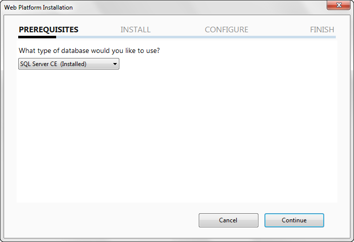
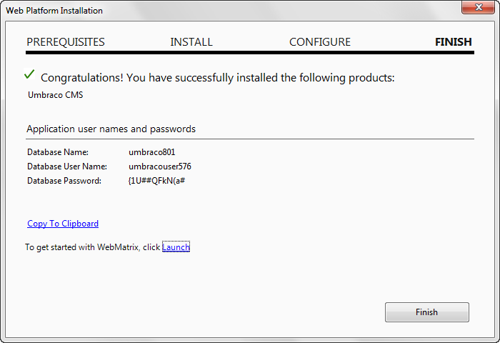

#Web Platform Installer step-by-step
1. Launch the webPI from the Microsoft Web Application Gallery (http://www.microsoft.com/web/gallery/Umbraco.aspx).
2. Select Umbraco from the Applications list, and then click Install if it is not already selected
3. From the prerequisites screen select the database of your choice
a. We strongly recommend selecting “SQL Server CE” if you are installing Umbraco to your local PC and for almost all development purposes

4. Once you click the I Agree button webPI will download and install Umbraco, including any dependencies required.  If all dependencies are already installed this will take just a moment, if many dependencies are requires it may take some patience.
5. When complete, webPI will display the database user name and password it created while installing the database.  We recommend making note of these as you may need them later

